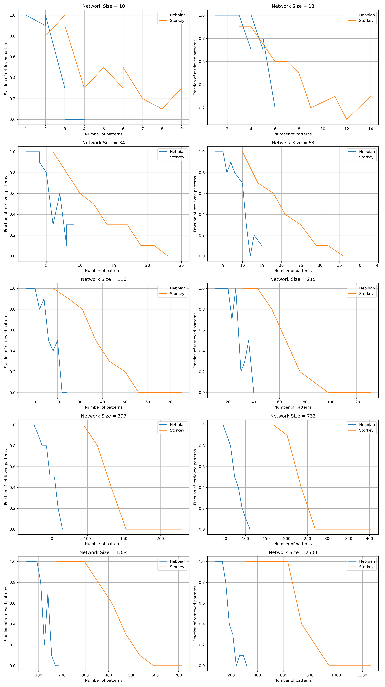
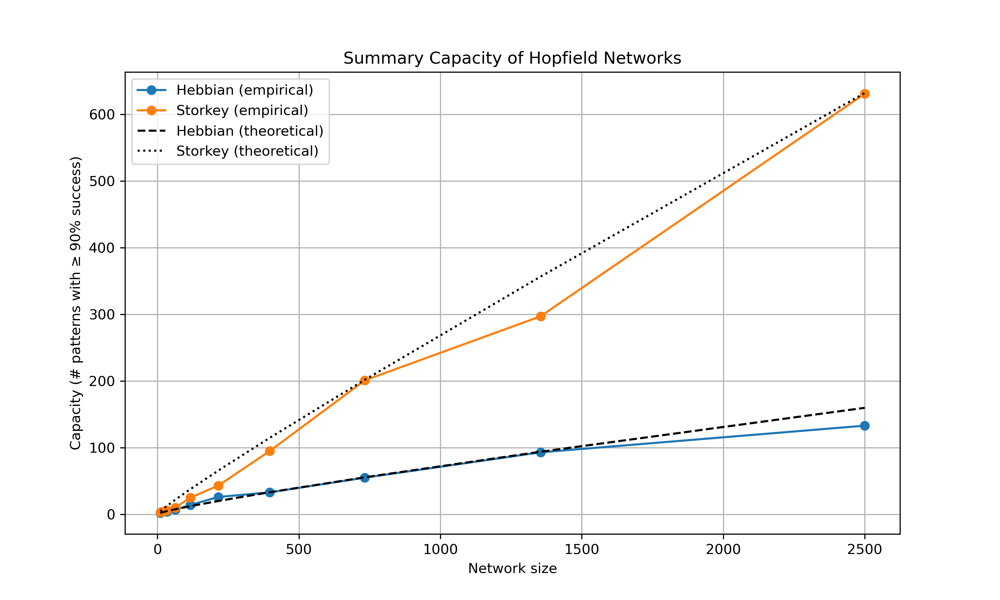
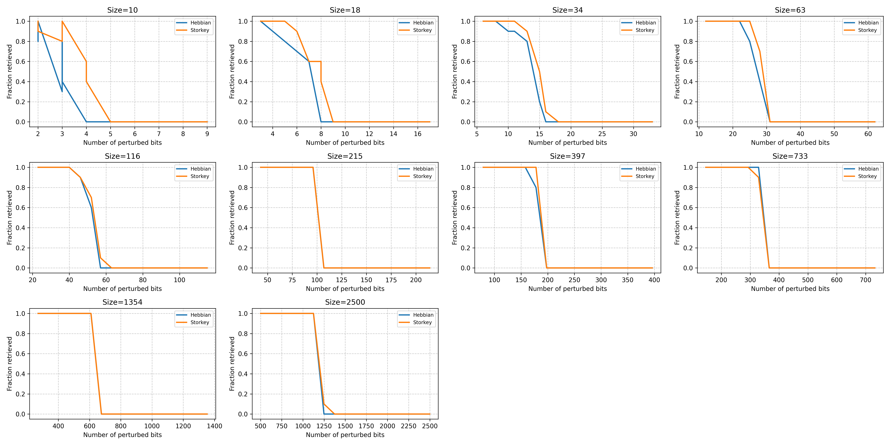
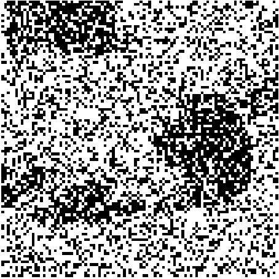

# Results of the Hopfield Network Analysis 

# PART 1

# Results of the Hopfield Network Analysis

## 1. Capacity Curves

### Methods:
- Patterns were randomly generated using binary values.
- Perturbations (noise) were introduced to test network retrieval accuracy.
- Hebbian and Storkey learning rules were applied to compute the weights, which define the strength of the connections between neurons and enable the storage of patterns.
- The fraction of successfully retrieved patterns was recorded for various network sizes.

### Explanation:
The following plot shows the **fraction of retrieved patterns** as a function of the **number of patterns stored**. Each subplot represents a network size, comparing Hebbian and Storkey rules.

### Observations:
As the number of patterns increases, the retrieval fraction generally decreases for both Hebbian and Storkey learning rules. However, their performance differs depending on the network size:

- **Small Networks (e.g., Size 10-34):** Both rules perform similarly, with the retrieval fraction decreasing sharply as the number of stored patterns increases. At these smaller sizes, the network quickly reaches its storage capacity.
- **Medium Networks (e.g., Size 116-215):** The Storkey rule demonstrates a noticeable advantage, maintaining higher retrieval fractions compared to the Hebbian rule as the number of stored patterns increases. This highlights the improved capacity of the Storkey rule for moderately sized networks.
- **Large Networks (e.g., Size 733-2500):** The Storkey rule's advantage becomes increasingly significant as the network size and storage capacity grow. It sustains higher retrieval fractions for a larger number of patterns, showcasing its scalability for bigger networks.

---

## 2. Summary of Capacities

### Methods:

- **Experimental Capacities:** Determined as the maximum number of patterns retrievable with a probability ≥ 90%.
- **Theoretical Capacities:** Calculated using the following formulas:

    **Hebbian Rule**:  
    $$
    \frac{n}{2 \log n}
    $$  

    **Storkey Rule**:  
    $$
    \frac{n}{\sqrt{2 \log n}}
    $$

### Explanation:
The plot below compares **experimental capacities** to the **theoretical limits** as a function of network size.

### Observations:
- **Alignment with Theory:** Experimental capacities closely follow the theoretical curves for both Hebbian and Storkey rules.
- **Higher Capacity for Storkey Rule:** As predicted, the Storkey rule achieves higher capacity compared to the Hebbian rule, especially for larger networks.
- **Logarithmic Growth:** The capacity grows logarithmically with the number of neurons, consistent with theoretical expectations.

---

## Conclusion:
The experiments validate the theoretical memory capacity limits of Hopfield networks. **Storkey learning consistently demonstrates better performance than Hebbian learning**, particularly for larger network sizes, by achieving superior retrieval performance and capacity.

While both rules exhibit similar behavior for small networks, the **Storkey rule consistently outperforms the Hebbian rule for medium and large networks**. This superiority is evident in its ability to sustain higher retrieval fractions and achieve higher capacity, showcasing its scalability.

The results confirm that the memory capacity of Hopfield networks grows logarithmically with the number of neurons, aligning closely with theoretical predictions. The **Storkey rule’s reduced interference between patterns** highlights its effectiveness in optimizing associative memory models.

---
---

# PART 2

# Results of the Hopfield Network Analysis

## 1. Robustness Tables

### Methods:
- Patterns with differents sizes were randomly generated using binary values.
- Increasing percentages of perturbations from 20% to 100% were introduced to test network retrieval.
- Hebbian and Storkey learning rules were applied.
- The fraction of successfully retrieved patterns versus the number of perturbations was recorded for each network size.

### Tables:

The following tables show for each network size and weight rule, the fraction of retrieved patterns for a number of perturbations.

|     |   network_size | weight_rule   |   num_patterns |   num_perturb |   match_frac |
|----:|---------------:|:--------------|---------------:|--------------:|-------------:|
|   0 |             10 | hebbian       |              2 |             2 |          0.8 |
|   1 |             10 | hebbian       |              2 |             2 |          1   |
|   2 |             10 | hebbian       |              2 |             3 |          0.3 |
|   3 |             10 | hebbian       |              2 |             3 |          0.8 |
|   4 |             10 | hebbian       |              2 |             3 |          0.4 |
|   5 |             10 | hebbian       |              2 |             4 |          0   |
|   6 |             10 | hebbian       |              2 |             4 |          0   |
|   7 |             10 | hebbian       |              2 |             5 |          0   |
|   8 |             10 | hebbian       |              2 |             5 |          0   |
|   9 |             10 | hebbian       |              2 |             6 |          0   |
|  10 |             10 | hebbian       |              2 |             7 |          0   |
|  11 |             10 | hebbian       |              2 |             7 |          0   |
|  12 |             10 | hebbian       |              2 |             7 |          0   |
|  13 |             10 | hebbian       |              2 |             8 |          0   |
|  14 |             10 | hebbian       |              2 |             9 |          0   |
|  15 |             10 | hebbian       |              2 |             9 |          0   |
|  16 |             10 | hebbian       |              2 |             9 |          0   |
|  17 |             10 | storkey       |              2 |             2 |          1   |
|  18 |             10 | storkey       |              2 |             2 |          0.9 |
|  19 |             10 | storkey       |              2 |             3 |          0.8 |
|  20 |             10 | storkey       |              2 |             3 |          0.9 |
|  21 |             10 | storkey       |              2 |             3 |          1   |
|  22 |             10 | storkey       |              2 |             4 |          0.6 |
|  23 |             10 | storkey       |              2 |             4 |          0.4 |
|  24 |             10 | storkey       |              2 |             5 |          0   |
|  25 |             10 | storkey       |              2 |             5 |          0   |
|  26 |             10 | storkey       |              2 |             6 |          0   |
|  27 |             10 | storkey       |              2 |             7 |          0   |
|  28 |             10 | storkey       |              2 |             7 |          0   |
|  29 |             10 | storkey       |              2 |             7 |          0   |
|  30 |             10 | storkey       |              2 |             8 |          0   |
|  31 |             10 | storkey       |              2 |             9 |          0   |
|  32 |             10 | storkey       |              2 |             9 |          0   |
|  33 |             10 | storkey       |              2 |             9 |          0   |
|  34 |             18 | hebbian       |              2 |             3 |          1   |
|  35 |             18 | hebbian       |              2 |             4 |          0.9 |
|  36 |             18 | hebbian       |              2 |             5 |          0.8 |
|  37 |             18 | hebbian       |              2 |             6 |          0.7 |
|  38 |             18 | hebbian       |              2 |             7 |          0.6 |
|  39 |             18 | hebbian       |              2 |             8 |          0   |
|  40 |             18 | hebbian       |              2 |             8 |          0   |
|  41 |             18 | hebbian       |              2 |             9 |          0   |
|  42 |             18 | hebbian       |              2 |            10 |          0   |
|  43 |             18 | hebbian       |              2 |            11 |          0   |
|  44 |             18 | hebbian       |              2 |            12 |          0   |
|  45 |             18 | hebbian       |              2 |            13 |          0   |
|  46 |             18 | hebbian       |              2 |            14 |          0   |
|  47 |             18 | hebbian       |              2 |            15 |          0   |
|  48 |             18 | hebbian       |              2 |            16 |          0   |
|  49 |             18 | hebbian       |              2 |            17 |          0   |
|  50 |             18 | hebbian       |              2 |            17 |          0   |
|  51 |             18 | storkey       |              2 |             3 |          1   |
|  52 |             18 | storkey       |              2 |             4 |          1   |
|  53 |             18 | storkey       |              2 |             5 |          1   |
|  54 |             18 | storkey       |              2 |             6 |          0.9 |
|  55 |             18 | storkey       |              2 |             7 |          0.6 |
|  56 |             18 | storkey       |              2 |             8 |          0.6 |
|  57 |             18 | storkey       |              2 |             8 |          0.4 |
|  58 |             18 | storkey       |              2 |             9 |          0   |
|  59 |             18 | storkey       |              2 |            10 |          0   |
|  60 |             18 | storkey       |              2 |            11 |          0   |
|  61 |             18 | storkey       |              2 |            12 |          0   |
|  62 |             18 | storkey       |              2 |            13 |          0   |
|  63 |             18 | storkey       |              2 |            14 |          0   |
|  64 |             18 | storkey       |              2 |            15 |          0   |
|  65 |             18 | storkey       |              2 |            16 |          0   |
|  66 |             18 | storkey       |              2 |            17 |          0   |
|  67 |             18 | storkey       |              2 |            17 |          0   |
|  68 |             34 | hebbian       |              2 |             6 |          1   |
|  69 |             34 | hebbian       |              2 |             8 |          1   |
|  70 |             34 | hebbian       |              2 |            10 |          0.9 |
|  71 |             34 | hebbian       |              2 |            11 |          0.9 |
|  72 |             34 | hebbian       |              2 |            13 |          0.8 |
|  73 |             34 | hebbian       |              2 |            15 |          0.2 |
|  74 |             34 | hebbian       |              2 |            16 |          0   |
|  75 |             34 | hebbian       |              2 |            18 |          0   |
|  76 |             34 | hebbian       |              2 |            20 |          0   |
|  77 |             34 | hebbian       |              2 |            22 |          0   |
|  78 |             34 | hebbian       |              2 |            23 |          0   |
|  79 |             34 | hebbian       |              2 |            25 |          0   |
|  80 |             34 | hebbian       |              2 |            27 |          0   |
|  81 |             34 | hebbian       |              2 |            28 |          0   |
|  82 |             34 | hebbian       |              2 |            30 |          0   |
|  83 |             34 | hebbian       |              2 |            32 |          0   |
|  84 |             34 | hebbian       |              2 |            33 |          0   |
|  85 |             34 | storkey       |              2 |             6 |          1   |
|  86 |             34 | storkey       |              2 |             8 |          1   |
|  87 |             34 | storkey       |              2 |            10 |          1   |
|  88 |             34 | storkey       |              2 |            11 |          1   |
|  89 |             34 | storkey       |              2 |            13 |          0.9 |
|  90 |             34 | storkey       |              2 |            15 |          0.5 |
|  91 |             34 | storkey       |              2 |            16 |          0.1 |
|  92 |             34 | storkey       |              2 |            18 |          0   |
|  93 |             34 | storkey       |              2 |            20 |          0   |
|  94 |             34 | storkey       |              2 |            22 |          0   |
|  95 |             34 | storkey       |              2 |            23 |          0   |
|  96 |             34 | storkey       |              2 |            25 |          0   |
|  97 |             34 | storkey       |              2 |            27 |          0   |
|  98 |             34 | storkey       |              2 |            28 |          0   |
|  99 |             34 | storkey       |              2 |            30 |          0   |
| 100 |             34 | storkey       |              2 |            32 |          0   |
| 101 |             34 | storkey       |              2 |            33 |          0   |
| 102 |             63 | hebbian       |              2 |            12 |          1   |
| 103 |             63 | hebbian       |              2 |            15 |          1   |
| 104 |             63 | hebbian       |              2 |            18 |          1   |
| 105 |             63 | hebbian       |              2 |            22 |          1   |
| 106 |             63 | hebbian       |              2 |            25 |          0.8 |
| 107 |             63 | hebbian       |              2 |            28 |          0.4 |
| 108 |             63 | hebbian       |              2 |            31 |          0   |
| 109 |             63 | hebbian       |              2 |            34 |          0   |
| 110 |             63 | hebbian       |              2 |            37 |          0   |
| 111 |             63 | hebbian       |              2 |            40 |          0   |
| 112 |             63 | hebbian       |              2 |            44 |          0   |
| 113 |             63 | hebbian       |              2 |            47 |          0   |
| 114 |             63 | hebbian       |              2 |            50 |          0   |
| 115 |             63 | hebbian       |              2 |            53 |          0   |
| 116 |             63 | hebbian       |              2 |            56 |          0   |
| 117 |             63 | hebbian       |              2 |            59 |          0   |
| 118 |             63 | hebbian       |              2 |            62 |          0   |
| 119 |             63 | storkey       |              2 |            12 |          1   |
| 120 |             63 | storkey       |              2 |            15 |          1   |
| 121 |             63 | storkey       |              2 |            18 |          1   |
| 122 |             63 | storkey       |              2 |            22 |          1   |
| 123 |             63 | storkey       |              2 |            25 |          1   |
| 124 |             63 | storkey       |              2 |            28 |          0.7 |
| 125 |             63 | storkey       |              2 |            31 |          0   |
| 126 |             63 | storkey       |              2 |            34 |          0   |
| 127 |             63 | storkey       |              2 |            37 |          0   |
| 128 |             63 | storkey       |              2 |            40 |          0   |
| 129 |             63 | storkey       |              2 |            44 |          0   |
| 130 |             63 | storkey       |              2 |            47 |          0   |
| 131 |             63 | storkey       |              2 |            50 |          0   |
| 132 |             63 | storkey       |              2 |            53 |          0   |
| 133 |             63 | storkey       |              2 |            56 |          0   |
| 134 |             63 | storkey       |              2 |            59 |          0   |
| 135 |             63 | storkey       |              2 |            62 |          0   |
| 136 |            116 | hebbian       |              2 |            23 |          1   |
| 137 |            116 | hebbian       |              2 |            29 |          1   |
| 138 |            116 | hebbian       |              2 |            34 |          1   |
| 139 |            116 | hebbian       |              2 |            40 |          1   |
| 140 |            116 | hebbian       |              2 |            46 |          0.9 |
| 141 |            116 | hebbian       |              2 |            52 |          0.6 |
| 142 |            116 | hebbian       |              2 |            57 |          0   |
| 143 |            116 | hebbian       |              2 |            63 |          0   |
| 144 |            116 | hebbian       |              2 |            69 |          0   |
| 145 |            116 | hebbian       |              2 |            75 |          0   |
| 146 |            116 | hebbian       |              2 |            81 |          0   |
| 147 |            116 | hebbian       |              2 |            86 |          0   |
| 148 |            116 | hebbian       |              2 |            92 |          0   |
| 149 |            116 | hebbian       |              2 |            98 |          0   |
| 150 |            116 | hebbian       |              2 |           104 |          0   |
| 151 |            116 | hebbian       |              2 |           110 |          0   |
| 152 |            116 | hebbian       |              2 |           115 |          0   |
| 153 |            116 | storkey       |              2 |            23 |          1   |
| 154 |            116 | storkey       |              2 |            29 |          1   |
| 155 |            116 | storkey       |              2 |            34 |          1   |
| 156 |            116 | storkey       |              2 |            40 |          1   |
| 157 |            116 | storkey       |              2 |            46 |          0.9 |
| 158 |            116 | storkey       |              2 |            52 |          0.7 |
| 159 |            116 | storkey       |              2 |            57 |          0.1 |
| 160 |            116 | storkey       |              2 |            63 |          0   |
| 161 |            116 | storkey       |              2 |            69 |          0   |
| 162 |            116 | storkey       |              2 |            75 |          0   |
| 163 |            116 | storkey       |              2 |            81 |          0   |
| 164 |            116 | storkey       |              2 |            86 |          0   |
| 165 |            116 | storkey       |              2 |            92 |          0   |
| 166 |            116 | storkey       |              2 |            98 |          0   |
| 167 |            116 | storkey       |              2 |           104 |          0   |
| 168 |            116 | storkey       |              2 |           110 |          0   |
| 169 |            116 | storkey       |              2 |           115 |          0   |
| 170 |            215 | hebbian       |              2 |            43 |          1   |
| 171 |            215 | hebbian       |              2 |            53 |          1   |
| 172 |            215 | hebbian       |              2 |            64 |          1   |
| 173 |            215 | hebbian       |              2 |            75 |          1   |
| 174 |            215 | hebbian       |              2 |            85 |          1   |
| 175 |            215 | hebbian       |              2 |            96 |          1   |
| 176 |            215 | hebbian       |              2 |           107 |          0   |
| 177 |            215 | hebbian       |              2 |           118 |          0   |
| 178 |            215 | hebbian       |              2 |           128 |          0   |
| 179 |            215 | hebbian       |              2 |           139 |          0   |
| 180 |            215 | hebbian       |              2 |           150 |          0   |
| 181 |            215 | hebbian       |              2 |           161 |          0   |
| 182 |            215 | hebbian       |              2 |           171 |          0   |
| 183 |            215 | hebbian       |              2 |           182 |          0   |
| 184 |            215 | hebbian       |              2 |           193 |          0   |
| 185 |            215 | hebbian       |              2 |           204 |          0   |
| 186 |            215 | hebbian       |              2 |           214 |          0   |
| 187 |            215 | storkey       |              2 |            43 |          1   |
| 188 |            215 | storkey       |              2 |            53 |          1   |
| 189 |            215 | storkey       |              2 |            64 |          1   |
| 190 |            215 | storkey       |              2 |            75 |          1   |
| 191 |            215 | storkey       |              2 |            85 |          1   |
| 192 |            215 | storkey       |              2 |            96 |          1   |
| 193 |            215 | storkey       |              2 |           107 |          0   |
| 194 |            215 | storkey       |              2 |           118 |          0   |
| 195 |            215 | storkey       |              2 |           128 |          0   |
| 196 |            215 | storkey       |              2 |           139 |          0   |
| 197 |            215 | storkey       |              2 |           150 |          0   |
| 198 |            215 | storkey       |              2 |           161 |          0   |
| 199 |            215 | storkey       |              2 |           171 |          0   |
| 200 |            215 | storkey       |              2 |           182 |          0   |
| 201 |            215 | storkey       |              2 |           193 |          0   |
| 202 |            215 | storkey       |              2 |           204 |          0   |
| 203 |            215 | storkey       |              2 |           214 |          0   |
| 204 |            397 | hebbian       |              2 |            79 |          1   |
| 205 |            397 | hebbian       |              2 |            99 |          1   |
| 206 |            397 | hebbian       |              2 |           119 |          1   |
| 207 |            397 | hebbian       |              2 |           138 |          1   |
| 208 |            397 | hebbian       |              2 |           158 |          1   |
| 209 |            397 | hebbian       |              2 |           178 |          0.8 |
| 210 |            397 | hebbian       |              2 |           198 |          0   |
| 211 |            397 | hebbian       |              2 |           218 |          0   |
| 212 |            397 | hebbian       |              2 |           238 |          0   |
| 213 |            397 | hebbian       |              2 |           258 |          0   |
| 214 |            397 | hebbian       |              2 |           277 |          0   |
| 215 |            397 | hebbian       |              2 |           297 |          0   |
| 216 |            397 | hebbian       |              2 |           317 |          0   |
| 217 |            397 | hebbian       |              2 |           337 |          0   |
| 218 |            397 | hebbian       |              2 |           357 |          0   |
| 219 |            397 | hebbian       |              2 |           377 |          0   |
| 220 |            397 | hebbian       |              2 |           396 |          0   |
| 221 |            397 | storkey       |              2 |            79 |          1   |
| 222 |            397 | storkey       |              2 |            99 |          1   |
| 223 |            397 | storkey       |              2 |           119 |          1   |
| 224 |            397 | storkey       |              2 |           138 |          1   |
| 225 |            397 | storkey       |              2 |           158 |          1   |
| 226 |            397 | storkey       |              2 |           178 |          1   |
| 227 |            397 | storkey       |              2 |           198 |          0   |
| 228 |            397 | storkey       |              2 |           218 |          0   |
| 229 |            397 | storkey       |              2 |           238 |          0   |
| 230 |            397 | storkey       |              2 |           258 |          0   |
| 231 |            397 | storkey       |              2 |           277 |          0   |
| 232 |            397 | storkey       |              2 |           297 |          0   |
| 233 |            397 | storkey       |              2 |           317 |          0   |
| 234 |            397 | storkey       |              2 |           337 |          0   |
| 235 |            397 | storkey       |              2 |           357 |          0   |
| 236 |            397 | storkey       |              2 |           377 |          0   |
| 237 |            397 | storkey       |              2 |           396 |          0   |
| 238 |            733 | hebbian       |              2 |           146 |          1   |
| 239 |            733 | hebbian       |              2 |           183 |          1   |
| 240 |            733 | hebbian       |              2 |           219 |          1   |
| 241 |            733 | hebbian       |              2 |           256 |          1   |
| 242 |            733 | hebbian       |              2 |           293 |          1   |
| 243 |            733 | hebbian       |              2 |           329 |          1   |
| 244 |            733 | hebbian       |              2 |           366 |          0   |
| 245 |            733 | hebbian       |              2 |           403 |          0   |
| 246 |            733 | hebbian       |              2 |           439 |          0   |
| 247 |            733 | hebbian       |              2 |           476 |          0   |
| 248 |            733 | hebbian       |              2 |           513 |          0   |
| 249 |            733 | hebbian       |              2 |           549 |          0   |
| 250 |            733 | hebbian       |              2 |           586 |          0   |
| 251 |            733 | hebbian       |              2 |           623 |          0   |
| 252 |            733 | hebbian       |              2 |           659 |          0   |
| 253 |            733 | hebbian       |              2 |           696 |          0   |
| 254 |            733 | hebbian       |              2 |           732 |          0   |
| 255 |            733 | storkey       |              2 |           146 |          1   |
| 256 |            733 | storkey       |              2 |           183 |          1   |
| 257 |            733 | storkey       |              2 |           219 |          1   |
| 258 |            733 | storkey       |              2 |           256 |          1   |
| 259 |            733 | storkey       |              2 |           293 |          1   |
| 260 |            733 | storkey       |              2 |           329 |          0.9 |
| 261 |            733 | storkey       |              2 |           366 |          0   |
| 262 |            733 | storkey       |              2 |           403 |          0   |
| 263 |            733 | storkey       |              2 |           439 |          0   |
| 264 |            733 | storkey       |              2 |           476 |          0   |
| 265 |            733 | storkey       |              2 |           513 |          0   |
| 266 |            733 | storkey       |              2 |           549 |          0   |
| 267 |            733 | storkey       |              2 |           586 |          0   |
| 268 |            733 | storkey       |              2 |           623 |          0   |
| 269 |            733 | storkey       |              2 |           659 |          0   |
| 270 |            733 | storkey       |              2 |           696 |          0   |
| 271 |            733 | storkey       |              2 |           732 |          0   |
| 272 |           1354 | hebbian       |              2 |           270 |          1   |
| 273 |           1354 | hebbian       |              2 |           338 |          1   |
| 274 |           1354 | hebbian       |              2 |           406 |          1   |
| 275 |           1354 | hebbian       |              2 |           473 |          1   |
| 276 |           1354 | hebbian       |              2 |           541 |          1   |
| 277 |           1354 | hebbian       |              2 |           609 |          1   |
| 278 |           1354 | hebbian       |              2 |           676 |          0   |
| 279 |           1354 | hebbian       |              2 |           744 |          0   |
| 280 |           1354 | hebbian       |              2 |           812 |          0   |
| 281 |           1354 | hebbian       |              2 |           880 |          0   |
| 282 |           1354 | hebbian       |              2 |           947 |          0   |
| 283 |           1354 | hebbian       |              2 |          1015 |          0   |
| 284 |           1354 | hebbian       |              2 |          1083 |          0   |
| 285 |           1354 | hebbian       |              2 |          1150 |          0   |
| 286 |           1354 | hebbian       |              2 |          1218 |          0   |
| 287 |           1354 | hebbian       |              2 |          1286 |          0   |
| 288 |           1354 | hebbian       |              2 |          1353 |          0   |
| 289 |           1354 | storkey       |              2 |           270 |          1   |
| 290 |           1354 | storkey       |              2 |           338 |          1   |
| 291 |           1354 | storkey       |              2 |           406 |          1   |
| 292 |           1354 | storkey       |              2 |           473 |          1   |
| 293 |           1354 | storkey       |              2 |           541 |          1   |
| 294 |           1354 | storkey       |              2 |           609 |          1   |
| 295 |           1354 | storkey       |              2 |           676 |          0   |
| 296 |           1354 | storkey       |              2 |           744 |          0   |
| 297 |           1354 | storkey       |              2 |           812 |          0   |
| 298 |           1354 | storkey       |              2 |           880 |          0   |
| 299 |           1354 | storkey       |              2 |           947 |          0   |
| 300 |           1354 | storkey       |              2 |          1015 |          0   |
| 301 |           1354 | storkey       |              2 |          1083 |          0   |
| 302 |           1354 | storkey       |              2 |          1150 |          0   |
| 303 |           1354 | storkey       |              2 |          1218 |          0   |
| 304 |           1354 | storkey       |              2 |          1286 |          0   |
| 305 |           1354 | storkey       |              2 |          1353 |          0   |
| 306 |           2500 | hebbian       |              2 |           500 |          1   |
| 307 |           2500 | hebbian       |              2 |           625 |          1   |
| 308 |           2500 | hebbian       |              2 |           750 |          1   |
| 309 |           2500 | hebbian       |              2 |           875 |          1   |
| 310 |           2500 | hebbian       |              2 |           999 |          1   |
| 311 |           2500 | hebbian       |              2 |          1125 |          1   |
| 312 |           2500 | hebbian       |              2 |          1249 |          0   |
| 313 |           2500 | hebbian       |              2 |          1374 |          0   |
| 314 |           2500 | hebbian       |              2 |          1499 |          0   |
| 315 |           2500 | hebbian       |              2 |          1624 |          0   |
| 316 |           2500 | hebbian       |              2 |          1750 |          0   |
| 317 |           2500 | hebbian       |              2 |          1874 |          0   |
| 318 |           2500 | hebbian       |              2 |          1999 |          0   |
| 319 |           2500 | hebbian       |              2 |          2124 |          0   |
| 320 |           2500 | hebbian       |              2 |          2250 |          0   |
| 321 |           2500 | hebbian       |              2 |          2374 |          0   |
| 322 |           2500 | hebbian       |              2 |          2499 |          0   |
| 323 |           2500 | storkey       |              2 |           500 |          1   |
| 324 |           2500 | storkey       |              2 |           625 |          1   |
| 325 |           2500 | storkey       |              2 |           750 |          1   |
| 326 |           2500 | storkey       |              2 |           875 |          1   |
| 327 |           2500 | storkey       |              2 |           999 |          1   |
| 328 |           2500 | storkey       |              2 |          1125 |          1   |
| 329 |           2500 | storkey       |              2 |          1249 |          0.1 |
| 330 |           2500 | storkey       |              2 |          1374 |          0   |
| 331 |           2500 | storkey       |              2 |          1499 |          0   |
| 332 |           2500 | storkey       |              2 |          1624 |          0   |
| 333 |           2500 | storkey       |              2 |          1750 |          0   |
| 334 |           2500 | storkey       |              2 |          1874 |          0   |
| 335 |           2500 | storkey       |              2 |          1999 |          0   |
| 336 |           2500 | storkey       |              2 |          2124 |          0   |
| 337 |           2500 | storkey       |              2 |          2250 |          0   |
| 338 |           2500 | storkey       |              2 |          2374 |          0   |
| 339 |           2500 | storkey       |              2 |          2499 |          0   |

### Curves:

The following curves show the **fraction of retrieved patterns** as a function of the **number of perturbations**. Each subplot represents a network size, comparing Hebbian and Storkey rules.

### Observations:
- Hebbian Rule:
For small patterns (e.g., size 18), the system stops converging after around 8 perturbations (40-45% noise).
For larger patterns (e.g., size 1354), the system can tolerate up to around 1250 perturbations (50% noise) before failing to converge, showing better resilience for larger patterns.

- Storkey Rule:
For small patterns (e.g., size 18), the system can tolerate around 9 perturbations (50% noise), performing better than Hebbian in this scenario.
For larger patterns (e.g., size 2500), the system can tolerate up to around 50% of perturbations, which is the same as for Hebbian.

---

## Conclusion:
In conclusion, both the Hebbian and Storkey learning rules exhibit varying levels of robustness depending on the pattern size. For smaller patterns, Storkey outperforms Hebbian, as it can tolerate a higher percentage of perturbations (up to 50% noise) before the system stops converging. However, for larger patterns, both rules demonstrate similar robustness, with the system failing to converge after around 50% of perturbations, indicating that both rules exhibit better resilience to noise as the pattern size increases. This suggests that while Storkey is more robust for smaller patterns, the two rules show comparable performance as the network size grows, with both showing increased noise tolerance in larger networks.

---
---

# PART 3

# Image Retrieval Using Hopfield Networks

## Original image

## Methods
- **Image Binarization**: A 100 x 100 pixel image was selected and binarized into values of +1 and -1.
- **Image Perturbation**: The image was corrupted.
- **Hopfield Network Storage**: The image was stored as a pattern in the Hopfield network using the Hebbian learning rule.
- **Image Retrieval**: Dynamics of the network were run to iteratively recover the complete image from the corrupted input.
- **Visualization**: A sequence of frames was generated to illustrate the retrieval process over time.

---

## Explanation
The following video illustrates the **image retrieval process**. Starting from an incomplete image, the network progressively reconstructs the original pattern over several iterations.

### Observations
1. **Initial State**: The corrupted image does not match the original one.
2. **Final State**: The retrieved image closely matches the original, demonstrating the Hopfield network's capacity to recall stored patterns from partial inputs.

---

## Results
- The Hopfield network successfully retrieved all stored images from partial inputs, though the quality of retrieval varied with the amount of noise.
- Retrieval speed was dependent on the level of occlusion, with more occluded images requiring additional iterations to converge.

|             Initial           |             Final          |
|-------------------------------|----------------------------|
|  |  |

**Video of Dynamics**: [Watch the full retrieval sequence](results/recall_image.mp4)

--- 

This demonstrates the robustness of the Hopfield network in recalling complete images, even from significantly corrupted inputs.
